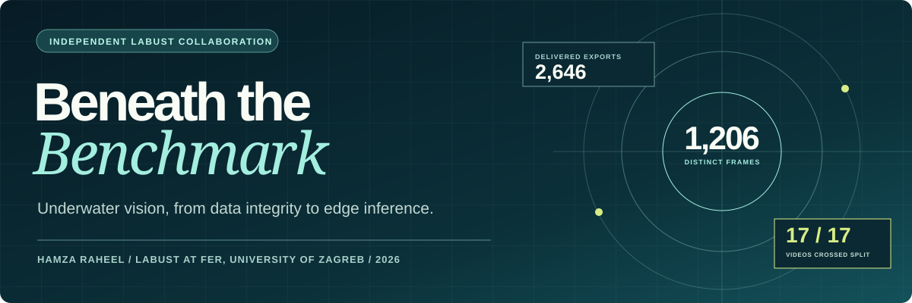
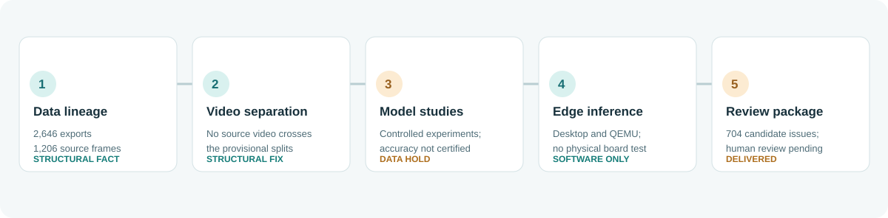
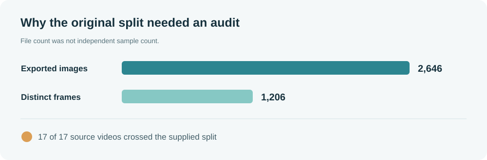

# Beneath the Benchmark

*Underwater detection, with the evidence left visible.*

An independent research record of a remote collaboration with the [Laboratory for Underwater Systems and Technologies (LABUST)](https://labust.fer.hr/) at the University of Zagreb's Faculty of Electrical Engineering and Computing, July–September 2026. Maintained by Hamza Raheel.

The project began with underwater object detection and a question about transfer to outdoor imagery. The most consequential result was methodological: the supplied image split could not support the generalization claims we wanted to test. We traced exports back to source videos, separated evaluation by video, ran bounded model studies, prototyped an edge-inference path, and finally prepared a human-review workflow for unresolved image and annotation problems. The collaboration concluded before the data could be certified or the model tested on a physical ROV.

> **Outcome, not a victory lap:** a clearer account of what the data can and cannot show, plus a reproducible route for review. This repository does **not** claim a field-ready detector, a certified accuracy improvement, or a completed correction of the source annotations.

## The project in one view

| Research question | What the record supports |
| --- | --- |
| Are the supplied images independent? | No. The outdoor export contains **2,646 images representing 1,206 distinct frames from 17 videos**. All 17 source videos appear on both sides of the supplied split. |
| Can evaluation be better isolated? | Yes, structurally. Complete videos were assigned to separate splits; this did **not** certify image orientation or box annotations. |
| Did more local labels solve detection? | Historical, bounded experiments were run, but their accuracy conclusions are **on hold** because the target labels are not certified. |
| Is there a path to edge inference? | A Python-free NCNN/C++ prototype and ARM builds completed desktop and emulated-ARM checks. **No physical Raspberry Pi or ROV benchmark** was completed. |
| What was handed over at the end? | An offline package for reviewing all 1,206 frames and **704 candidate issues across 636 frames**. Candidates are not confirmed errors or approved corrections. |

## Explore the work

- [Research story](docs/RESEARCH_STORY.md) — the progression from the first audit to the final handoff.
- [Evidence and limits](docs/EVIDENCE.md) — what was measured, what became provisional, and what was never tested.
- [Experiment map](docs/EXPERIMENT_MAP.md) — six research questions spanning 31 historical result records, without treating them as validated wins.
- [Reproduce the structural audit](docs/REPRODUCE.md) — a small, runnable tool using filenames from the publisher's dataset; no source media is mirrored here.
- [Project credits and data provenance](docs/CREDITS.md) — roles, source attribution, and the independence of this record.

## Run the public audit tool

The included tool reads filenames only. Point it at a locally extracted copy of the [publisher's dataset](https://github.com/labust/PPE_underwater_dataset):

~~~bash
python3 tools/audit_export.py /path/to/extracted-dataset
python3 -m unittest discover -s tests -v
~~~

It reports image exports, distinct source frames, source videos, and video/frame overlap across splits. It never uploads, modifies, or embeds the images. See the [reproduction guide](docs/REPRODUCE.md) for the expected directory layout and interpretation.

## Scope of this public record

This is a curated case study, not the private working archive. It contains no meeting recordings, correspondence, unpublished manuscript, original footage, derived image bundle, model weights, or personal contact details. The figures are original schematics, not screenshots from LABUST media. Names and institutional roles in the [credits](docs/CREDITS.md) are factual attribution, not an endorsement of this independent publication.

**Status:** research collaboration concluded September 2026 · **Data evidence:** unresolved annotation/orientation review · **Deployment evidence:** software prototype only.
